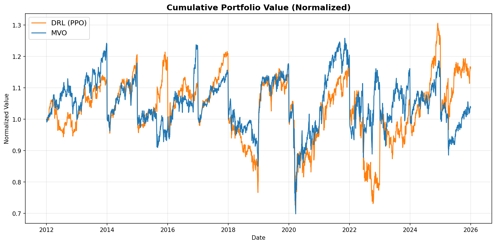
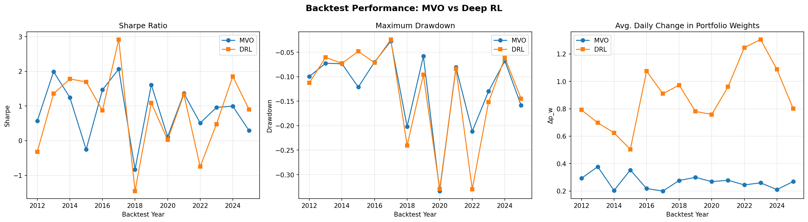

# DRL Portfolio Optimizer

Replication of [Sood et al. (2023)](https://arxiv.org/abs/2401.01843), comparing a PPO-based reinforcement learning agent against Mean-Variance Optimization (MVO) for sector ETF portfolio allocation.

Trained and backtested across 14 sliding one-year windows (2012-2025) on the 11 S&P 500 sector ETFs.

## Results




Pre-trained models and full backtest outputs are in `models/` and `results/`.

## Setup

```bash
pip install -r requirements.txt
```

## Usage

```bash
python main.py all           # full pipeline
python main.py fetch         # download market data
python main.py features      # compute features
python main.py train-ppo     # train PPO agents
python main.py run-mvo       # run MVO strategy
python main.py backtest      # backtest both strategies
python main.py evaluate      # generate metrics and figures
```

Add `--debug` for a fast reduced run.

## Structure

```
agents/      PPO and MVO strategy implementations
backtest/    backtesting engine and metrics
data/        data fetching and feature engineering
env/         Gymnasium portfolio environment
evaluation/  figures and comparison tables
models/      trained PPO checkpoints (14 windows)
results/     backtest outputs and plots
config.py    hyperparameters
```
